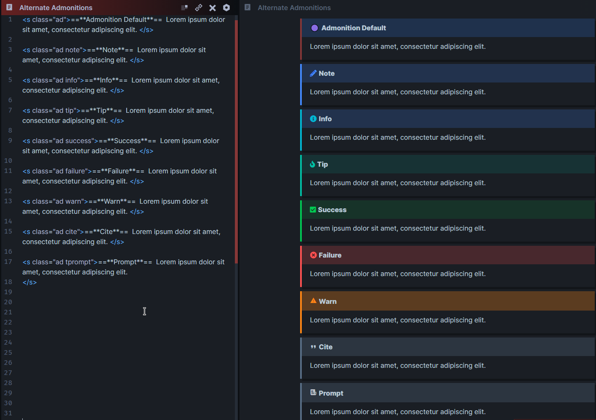
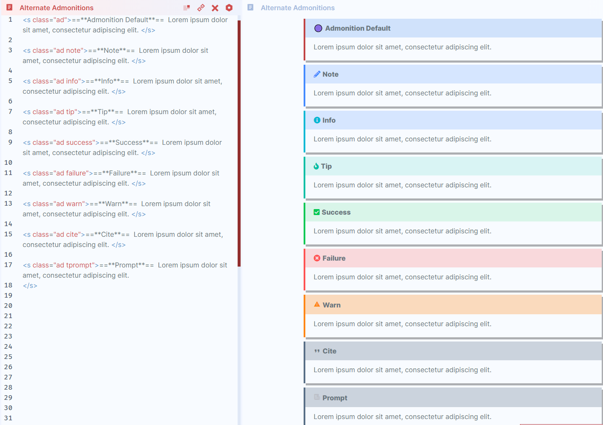

# Alternate Admonitions

> HTML version of the [Admonition](https://publish.obsidian.md/hub/02+-+Community+Expansions/02.05+All+Community+Expansions/Plugins/obsidian-admonition) plugin.

Primary purpose of this snippet is getting [Admonitions](https://publish.obsidian.md/hub/02+-+Community+Expansions/02.05+All+Community+Expansions/Plugins/obsidian-admonition) to work on Obsidian Publish. **Alternate Admonitions** has the same markdown support and limitations as the [Aside Snippet](https://publish.obsidian.md/hub/02+-+Community+Expansions/02.05+All+Community+Expansions/CSS+Snippets/Asides+(SlRvb)#Markdown%20Supported).

[**Get CSS Snippet Here**](https://github.com/SlRvb/Obsidian--ITS-Theme/blob/main/S%20-%20Admonitions.css)






---

# Syntax

```md
<s class="ad note">==**Title**==
Text
</s>

<s class="ad info">==**Title**== Text</s>
```

