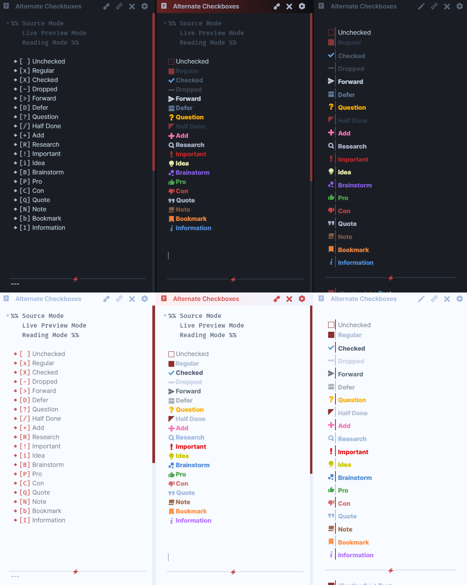
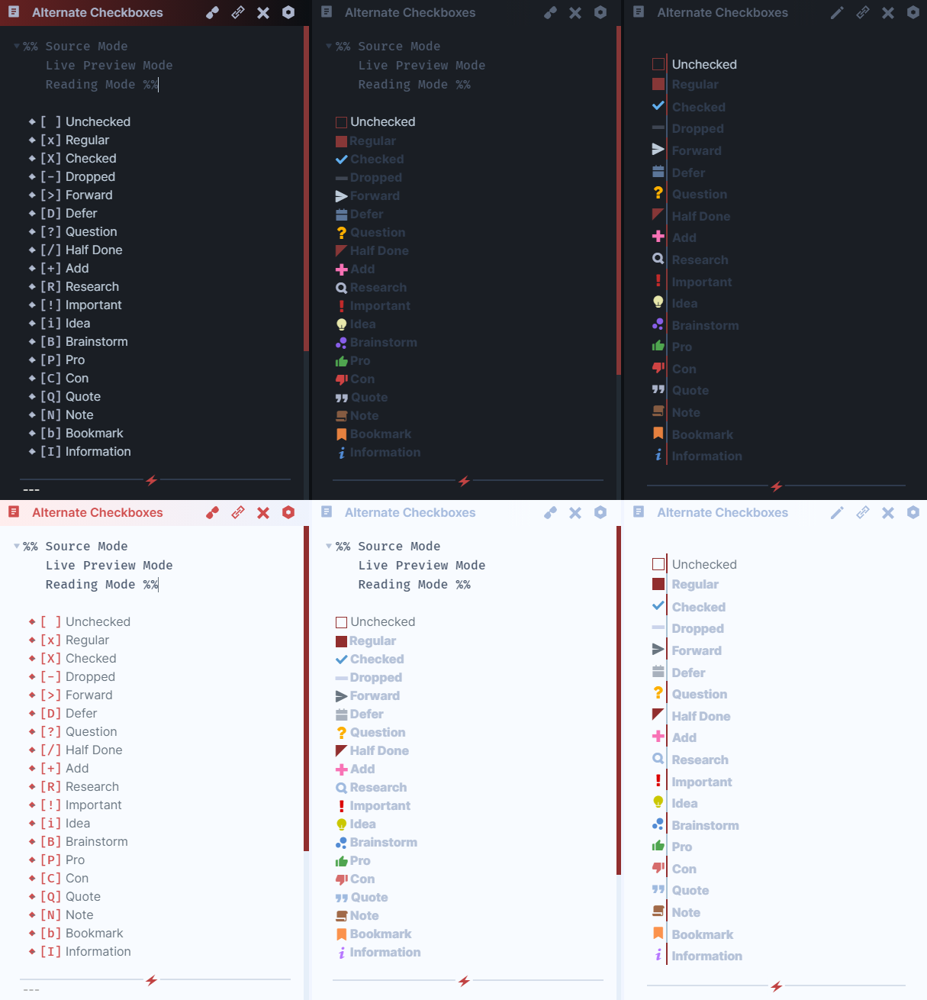
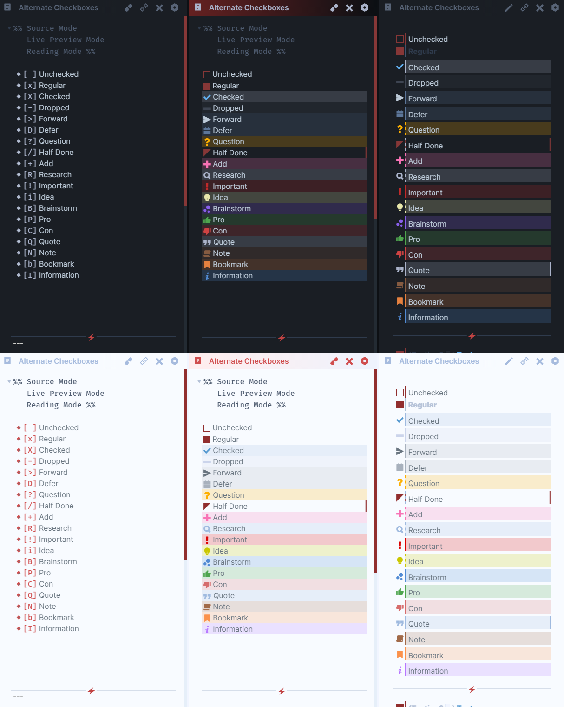

# Alternate Checkboxes

> Different checkbox types

[Download CSS Snippet](https://github.com/SlRvb/Obsidian--ITS-Theme/blob/main/Snippets/S%20-%20Checkboxes.css)

#  Checkbox Types
```markdown
- [ ] Unchecked
- [x] Regular
- [X] Checked
- [-] Dropped
- [>] Forward
- [D] Defer
- [?] Question
- [/] Half Done
- [+] Add
- [R] Research
- [!] Important
- [i] Idea
- [B] Brainstorm
- [P] Pro
- [C] Con
- [Q] Quote
- [N] Note
- [b] Bookmark
- [I] Information
- [p] Paraphrase
- [L] Location
- [E] Example
- [A] Answer
- [r] Reward
- [c] Choice
```

# Styling
Style Settings found under:
`Note Elements > Lists > Checkboxes`

**Colorful Text**
Toggled on by default 


**Dim Text**


**Colorful Backgrounds:**

