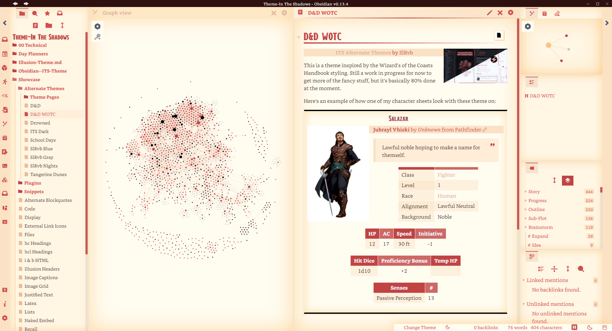
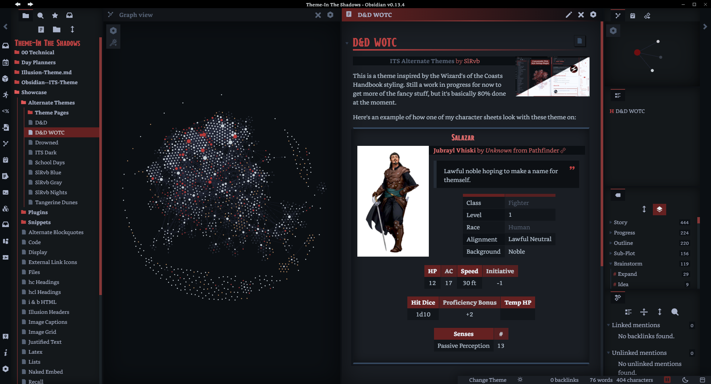
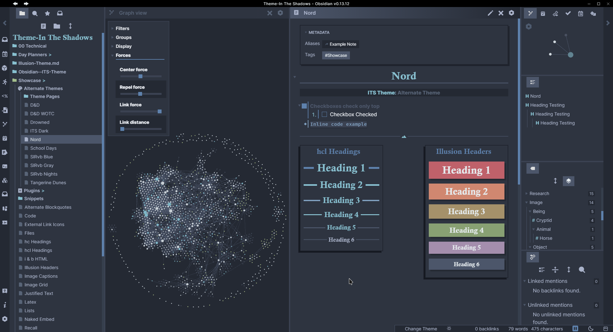
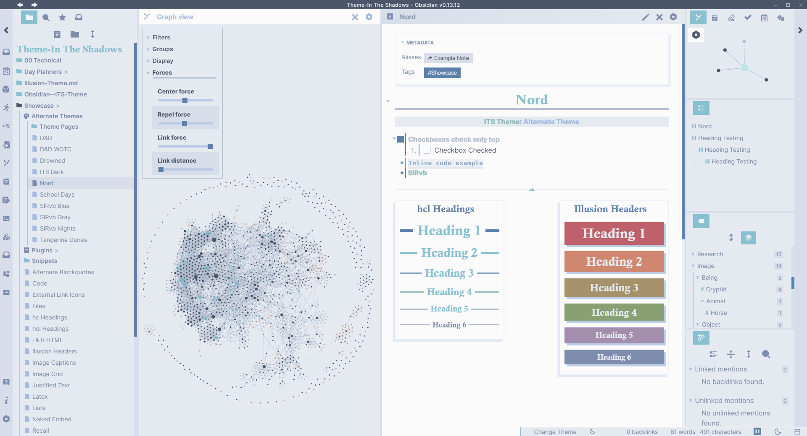

# Alternate Themes
> [All Alternate Themes](https://github.com/SlRvb/Obsidian--ITS-Theme/blob/main/Theme%20-%20All%20Alternate%20Themes.css) are available in 1 snippet as well instead of many separate css snippets. 
> 
> Use the **[Style Settings plugin](https://github.com/mgmeyers/obsidian-style-settings)** to toggle one of them on.

> **Note**
> These are also available in the theme itself, if you're using the ITS Theme, the only thing this snippet will offer is preloaded fonts.

# How To Install

1. Go to the [All Alternate Themes Snippet](https://github.com/SlRvb/Obsidian--ITS-Theme/blob/main/Theme%20-%20All%20Alternate%20Themes.css)
	*(**Note:** This snippet is updated more often than the other `Theme--` snippets, I highly recommend using this one)*

2. Click the download and copy the entire new tab of css

3. In Obsidian, open `Settings > Appearance` and click the folder icon beside the `CSS snippets` header

4. Create a new `.css` file in that folder

5. Open that new file, paste the css, and save

6. In Obsidian click the reload icon beside the `CSS Snippet` header

7. Toggle the snippet on

8. With the [Style Settings plugin](https://github.com/mgmeyers/obsidian-style-settings) installed, open the Style Settings menu

9. Click on `ITS Alternate Themes` to show the selection of themes

# SlRvb Gray
[Link](https://github.com/SlRvb/Obsidian--ITS-Theme/blob/main/Theme%20-%20SlRvb%20Gray.css)

**Fonts used:**
- Headings: [Norwester](https://jamiewilson.io/norwester/)
	- [Staatliches](https://fonts.google.com/specimen/Staatliches)
	- [Racing Sans One](https://fonts.google.com/specimen/Racing+Sans+One)
	- [Heavitas](https://www.dafont.com/heavitas.font)
	- [Playfair Display](https://fonts.google.com/specimen/Playfair+Display)

# SlRvb Blue
[Link](https://github.com/SlRvb/Obsidian--ITS-Theme/blob/main/Theme%20-%20SlRvb%20Blue.css)

**Fonts used:**
- Headings: [Recursive Sans Linear Static Black](https://www.recursive.design/)
- Monospace: [Fira Code](https://github.com/tonsky/FiraCode)

# D&D
[Link](https://github.com/SlRvb/Obsidian--ITS-Theme/blob/main/Theme%20-%20DnD.css)

**Fonts used:**
- Headings: [Cinzel Decorative](https://fonts.google.com/specimen/Cinzel+Decorative)
	- [Oleo Script](https://fonts.google.com/specimen/Oleo+Script)
	- [Lobster](https://fonts.google.com/specimen/Lobster?)
- Monospace: [Fira Code](https://github.com/tonsky/FiraCode)

# D&D WOTC

**Fonts used:**
- Headings: [Draconic](https://www.dafont.com/draconis.font)
- Text: [Bookerly](https://www.cufonfonts.com/font/bookerly)
- Monospace: [Fira Code](https://github.com/tonsky/FiraCode)

# School Days
[Link](https://github.com/SlRvb/Obsidian--ITS-Theme/blob/main/Theme%20-%20School%20Days.css)

**Fonts used:**
- Vault Name: [Collegiate](https://www.dafont.com/collegiateflf.font)
	- [Jersey M54](https://www.dafont.com/jersey-m54.font)
- Headings: [Recursive Sans Linear Static Black](https://www.recursive.design/)
	- [RocknRoll One](https://fonts.google.com/specimen/RocknRoll+One)
- Monospace: [Recursive Mono Linear Static Medium](https://www.recursive.design/)

# Tangerine Dunes
[Link](https://github.com/SlRvb/Obsidian--ITS-Theme/blob/main/Theme%20-%20Tangerine%20Dunes.css)

# Drowned
[Link](https://github.com/SlRvb/Obsidian--ITS-Theme/blob/main/Theme%20-%20Drowned.css)

# Nord

# ITS Dark
[Link](https://github.com/SlRvb/Obsidian--ITS-Theme/blob/main/Theme%20-%20ITS%20Dark.css)

