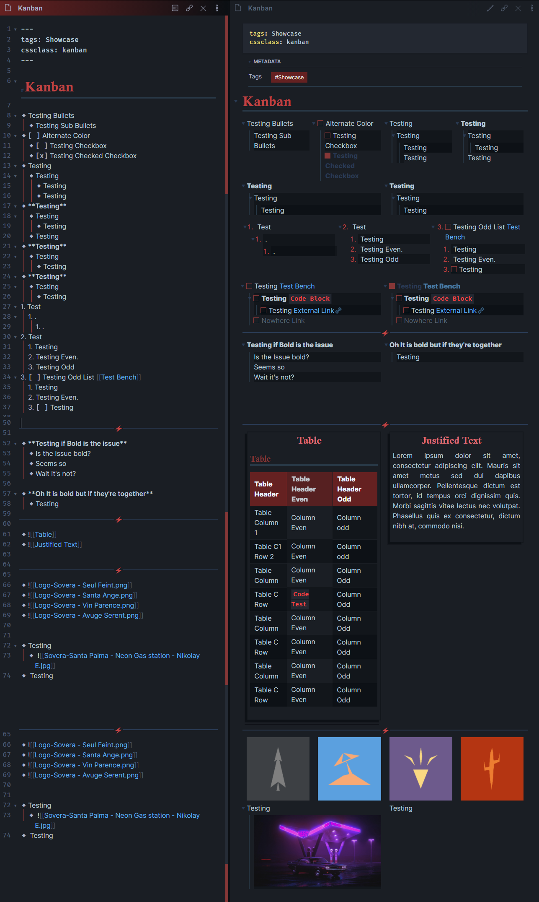

# Kanban

> Kanban snippet restyles lists in preview mode to sit side by side.

Heavily edited version of Maned's Kanban css from their theme [Spectrum](https://publish.obsidian.md/hub/02+-+Community+Expansions/02.05+All+Community+Expansions/Themes/Spectrum). **Full credit** to Manedblackwolf for such amazing work!

-   Side-by-Side Lists
-   Side-by-Side Images (For a kind of Image grid)
-   Side-by-Side Embeds

---

> **Note**
> **[Callout Kanban](Callouts.md#image-grid) is also available and mimics the Kanban Plugin styling**

Add this to the frontmatter/yaml of your note:
```yaml
---
cssclass: kanban
---
```

