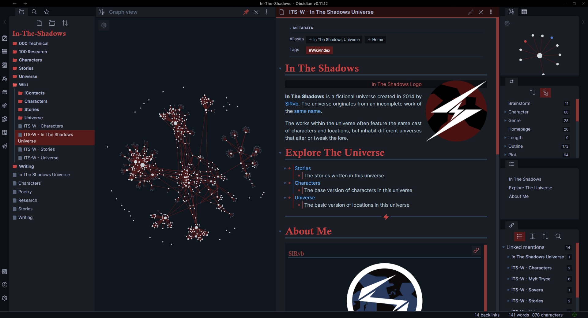
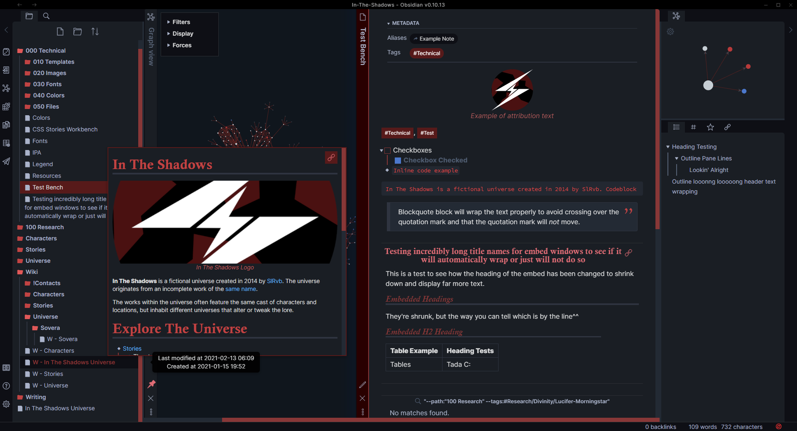
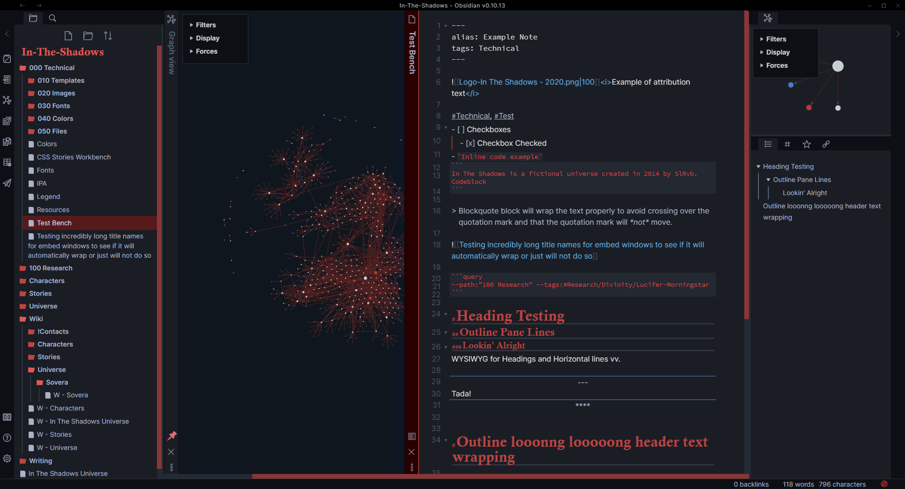
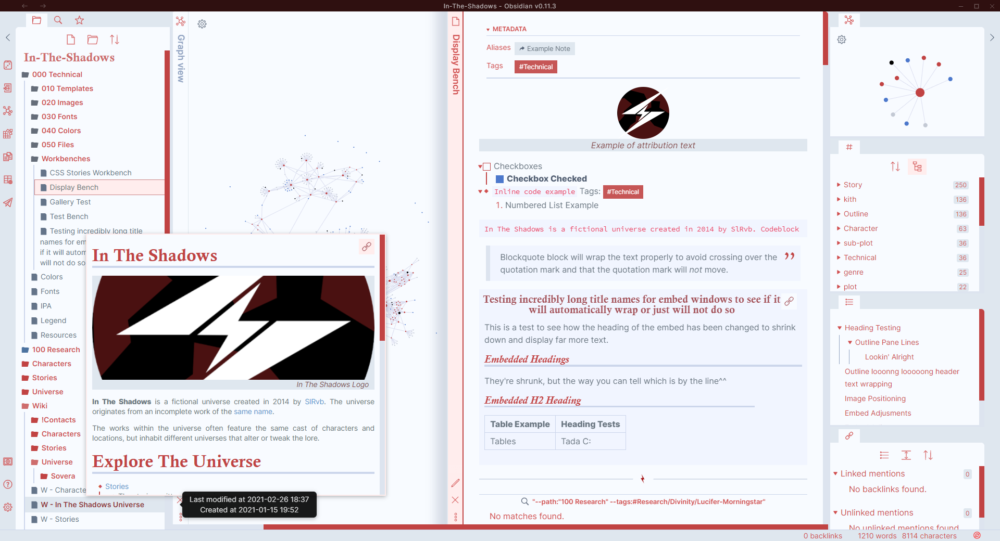
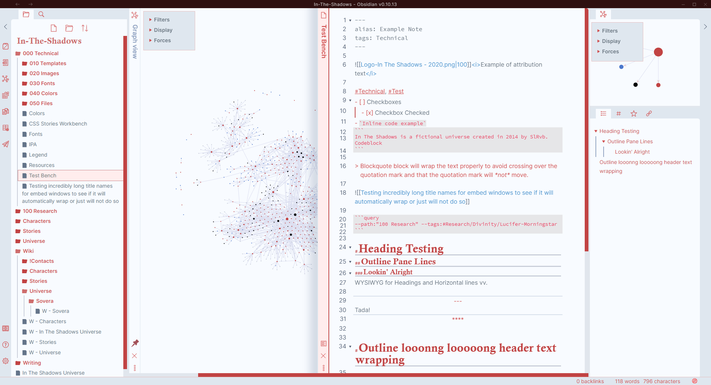
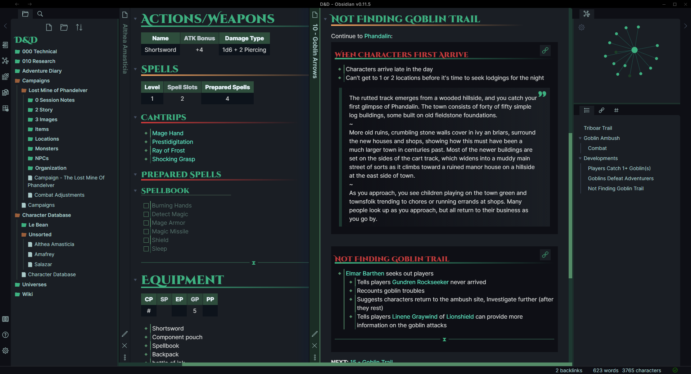
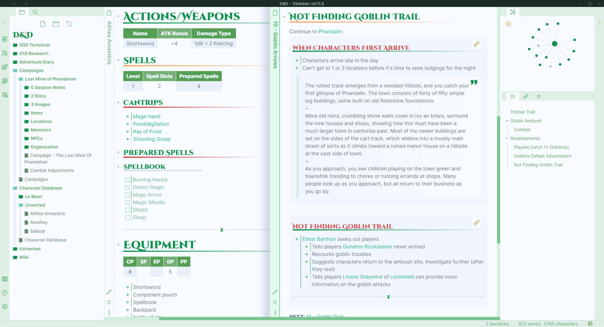
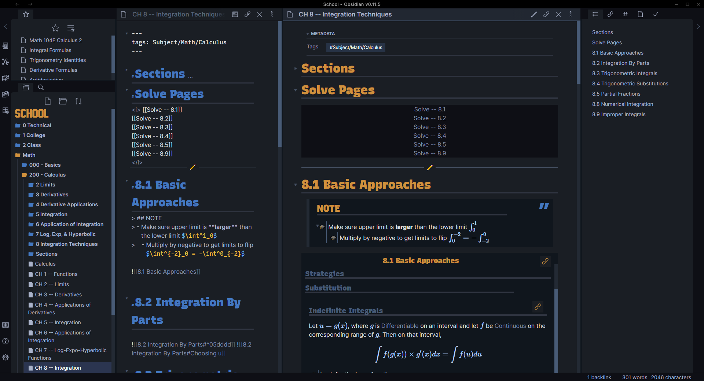

[](https://ko-fi.com/N4N64JN4L)

# ITS Theme
**By SlRvb**

> Theme for my Obsidian Story Vault: **In The Shadows**.


---
# Table of Contents
- [Features](#features)
- [Preview](#images)
- [CSS Classes](#css-classes)
- [Image Positions](#image-positions)
	- [Simplified Version](#simplified-version)
	- [Customizable Version](#customizable-version)
- [Embed Adjustments](#embed-adjustments)
- [Aside](#aside)
- [Alternate Themes Snippets](#alternate-themes)


# Features
- **Dark and Light mode**
- Colored Graph
- Squared Edges
- **Heading:**
	- **Underline**: spans across the page depending on the heading
	- **Embeded:** Embedded files have smaller headers and are 1 color
- Custom Horizontal line
	- *Credit:* [TriDiamond](https://forum.obsidian.md/t/meta-post-common-css-hacks/1978/223)
- Tag Pills (Rectangular)
- Metadata minimal style
- Checkboxes
	- *Credit:* [Kepano: Nicer Checkboxes](https://forum.obsidian.md/t/nicer-checkboxes/2238)
- **Images:**
	- Images Centered
	- **Zoom:** images enlarges upon clicking and holding it 
		- *Credit:* [Kepano: Image Zoom Click Hold To Expand Images](https://forum.obsidian.md/t/image-zoom-click-hold-to-expand-images/5164)
	- **Image Positions:** Move images to either left, right, center, change types, etc.
		- Inspired by: [Lithou's Image Flags](https://github.com/Lithou/Sandbox/blob/main/.obsidian/snippets/pub-Image%20Flags.css)
		- *If you use lithou's snippet, this feature does conflict with it.*
- **\<i>\</i>** for images or other files attributions
	- Adds a different color to text within it to differentiate it from other text
	- Centered to match image centering
	- Adding: `alt="left"` and `alt="right"` within it will push the attribute to left and right of the screen.
- **Blockquotes**
	- Soft background
	- Wider blockquote
	- Quotation marks added top right corner
- **Popover**
	- Larger Popover
	- Images fit within the popover window
	- Images are cropped in popover window
- **Line Relationships**
	- Bullet Points
		- *Credit:* [Lizardmenfromspace](https://forum.obsidian.md/t/meta-post-common-css-hacks/1978/2)
	- Outline Pane
	- Folder Navigation
	- Tag Pane
- **Folder Navigation Icons**
	- Credit: [Deathau](https://forum.obsidian.md/t/meta-post-common-css-hacks/1978/109)
- **Text Wrapping**
	- Outline Pane
	- Tag Pane
	- File Explorer Sidebar
	- Embed Titles
	- Query Titles
- **Embed Adjustments**
- **Aside** for comments/etc
- **Style Settings Plugin Suported**
- **Fonts:** (Main ones are near the `listed:`, alternates are below it)
	- **Headings:** [Calisto MT]()
		- [Suez One](https://fonts.google.com/specimen/Suez+One)
		- [Palatino Black](https://www.fonts.com/font/linotype/palatino/black)
		- [Georgia Bold](https://www.fonts.com/font/microsoft-corporation/georgia/bold)
	- **Monospace:** [JetBrains Mono Medium](https://www.jetbrains.com/lp/mono/)
		- [Recursive Mono Casual Static Medium](https://www.recursive.design/)

# Preview

## Darkmode


**Features**

**Edit Mode**


## Lightmode


**Features**

**Edit Mode**


# CSS Classes
CSS Classes to add in the frontmatter/yaml to change the way a page looks.

**Example:**
```
---
cssclass: table, t-c, no-m
---
```

Classes | Description
---|---|
`no-m` | Fully hide Frontmatter on just that page
`justified` | Justifies text
`readable` | Set readable line width to just that page when readable line width is off
`writing` | Centers Headings, justifies text, auto sets readable line width
`poem` | Centers text
`kanban` | Turn lists into kanban-like boards
`table` | First column background darker and text bolded
`t-c` | Center tables
`t-w` | Table expands to fill the whole width of the file

## Ids 

`<s id="#col"></s>`

Classes | Description
---|---|
`#col` | Show/Create a color block
`#font` | Showcase a font in huge sized text

# `<i></i>` Attributes

Alt="\_" | Description
---|---|
`left` | Move text of `<i>` to the left
`right` | Move text of `<i>` to the right
`no-bg` | Remove the background color of `<i>`
`clear` | Equivalent of a `<br>` or an enter.

# Aside
Recommend using `<s class="aside-">Text</s>` to keep markdown formatting.

Class | Description |
---|---|
`aside-show` | Aside content will be shown in the margin of the page.
`aside-hide` | Aside content will be hidden and only display an icon 🗨.<br>To see comment, hover over the icon
`aside-in` | Aside content will be embedded inside the page.

**Examples:**
Aside code is highlighted.


# Image Positions
Obsidian internal images `![[]]` will change immediately, but for external images ``, the page needs to be reopened to see the changes. 

### Clear

Example | Description |
---|---|
`![[image.png\|clear]]`| `clear` will allow that image to sit below another image<br>If it's on the same side instead of sitting in the middle of the page.

### Cover (Mostly for Customizable Version)

Example | Description |
---|---|
`![[image.png\|cover]]`| `cover` will resize the image, maintain aspect ratio and avoid stretching.

### Sizing (Mostly for Customizable Version)

Example | Description |
---|---|
`![[image.png\|loc\|sban\|200]]`| Place the `\|<numbers>` sizing at the *end* of the text and it will shrink the image to that size.


## Simplified Version
### Left/Right/Center

Example | Description |
---|---|
`![[image.png\|left]]`| `left` will move the image to the left.
`![[image.png\|right]`| `right` will move the image to the right.
`![[image.png\|c]`| `c` will move the image to the center.


### Banner

Example | Description |
---|---|
`![[image.png\|banner]]`| `banner` will crop the image height-wise to about 150px while setting the width to cover the entire page.
`![[image.png\|banner+small]]`| `banner+small` will crop the image height-wise to about 100px while setting the width to cover the entire page.
`![[image.png\|banner+tall]]`| `banner+tall` will crop the image height-wise to about 500px while setting the width to cover the entire page.


### Portrait

Example | Description |
---|---|
`![[image.png\|portrait]]`| `portrait` will crop the image width-wise to about 40% while setting the height to a standard of about 400px.
`![[image.png\|portrait+small]]`| `portrait+small` will crop the image width-wise to about 20% while setting the height to a standard of about 200px.
`![[image.png\|portrait+tall]]`| `portrait+tall` will crop the image width-wise to about 50% while setting the height to a standard of about 500px.


### Profile
> ⚠ Not fully working unless you use the `pc` property.

Example | Description |
---|---|
`![[image.png\|profile]]`| `profile` will round the borders of the image to create a round image and size it to about 100px.
`![[image.png\|profile+medium]]`| `profile+medium` will round the borders of the image to create a round image and resize it to about 250px.


## Customizable Version
### Left/Right

Example | Description |
---|---|
`![[image.png\|locl]]`| `locl` will move the image to the left.
`![[image.png\|locr]]`| `locr` will move the image to the right.


### Inner Image Position

Example | Description |
---|---|
`![[image.png\|pl]]`| `pl` will move the inside of the image to the left.
`![[image.png\|pr]]`| `pr` will move the inside of the image to the right.
`![[image.png\|pt]]`| `pt` will move the inside of the image to the top.
`![[image.png\|pb]]`| `pb` will move the inside of the image to the bottom.
`![[image.png\|pc]]`| `pc` will move the inside of the image to the center.


### Inner Image Position Adjustments
These will inch the images around if the ^ above code isn't enough.

Example | Description |
---|---|
`![[image.png\|p+cr]]`| `p+cr` will move the inside of the image to the center right.
`![[image.png\|p+cl]]`| `p+cl` will move the inside of the image to the center left.
||
`![[image.png\|p+ct]]`| `p+ct` will move the inside of the image to the center top of the image.
`![[image.png\|p+cct]]`| `p+cct` will move the inside of the image to the center top, slightly higher than `p+ct`|
`![[image.png\|p+tc]]`| `p+tc` will move the inside of the image to the center top, slightly lower than `pt`|
`![[image.png\|p+tcc]]`| `p+tcc` will move the inside of the image to the center top, slightly lower than `p+tc`|
||
`![[image.png\|p+cb]]`| `p+cb` will move the inside of the image to the center bottom of the image.
`![[image.png\|p+ccb]]`| `p+ccb` will move the inside of the image to the center bottom, slightly lower than `p+cb`|
`![[image.png\|p+bc]]`| `p+bc` will move the inside of the image to the center bottom, slightly higher than `pb`|
`![[image.png\|p+bcc]]`| `p+bcc` will move the inside of the image to the center bottom, slightly higher than `p+bc`|

#### Examples
*Note that these side by side images are done with the .img-grid cssclass that now no longer works*

**Left/Right**


**Top/Bottom Example**


### Sizing

Example | Description |
---|---|
`![[image.png\|htiny]]`|`htiny` will resize the image to about 100px in height.
`![[image.png\|hsmall]]`| `hsmall` will resize the image to about 200px in height.
`![[image.png\|hs-med]]`| `hs-med` will resize the image to about 300px in height.
`![[image.png\|hm-sm]]`| `hm-sm` will resize the image to about 400px in height.
`![[image.png\|hmed]]`| `hmed` will resize the image to about 500px in height.
`![[image.png\|hm-tl]]`| `hm-tl` will resize the image to about 600px in height.
`![[image.png\|htall]]`| `htall` will resize the image to about 700px in height.
||
`![[image.png\|wtiny]]`| `wtiny` will resize the image to about 100px in width.
`![[image.png\|wsmall]]`| `wsmall` will resize the image to about 200px in width.
`![[image.png\|ws-med]]`| `ws-med` will resize the image to about 300px in width.
`![[image.png\|wm-sm]]`| `wm-sm` will resize the image to about 400px in width.
`![[image.png\|wmed]]`| `wmed` will resize the image to about 500px in width.
`![[image.png\|wm-tl]]`| `wm-tl` will resize the image to about 600px in width.
`![[image.png\|wtall]]`| `wtall` will resize the image to about 700px in width.


# Embed Adjustments

> **Embed Adjustments use the same [parameters](#sizing) as the images for resizing it and [moving it](#left-right-center) (except for `c`).**

Example | Description
---|---|
`![[Embed Page\|no-lk]]` | Hide the link
`![[Embed Page\|lk-l]]` | Move link to the left
`![[Embed Page\|lk-clear]]` | Make background of the link transparent
`![[Embed Page\|no-m]]` | Will remove margins and padding

## Heading & Titles

Example | Description
---|---|
`![[Embed Page\|no-title]]` | Hide the title of the embedded page
`![[Embed Page\|no-h]]` | Hide all headers in the embedded page
`![[Embed Page\|no-h1]]` | Hide all header 1s in the embedded page
`![[Embed Page\|no-h2]]` | Hide all header 2s in the embedded page
`![[Embed Page\|no-h3]]` | Hide all header 3s in the embedded page
`![[Embed Page\|no-h4]]` | Hide all header 4s in the embedded page
`![[Embed Page\|no-h5]]` | Hide all header 5s in the embedded page
`![[Embed Page\|no-h6]]` | Hide all header 6s in the embedded page


# Alternate Themes

## SlRvb


- Headings: [Recursive Sans Linear Static Black](https://www.recursive.design/)
- Monospace: [Fira Code](https://github.com/tonsky/FiraCode)

## D&D



**Fonts used:**
- Headings: [Cinzel Decorative](https://fonts.google.com/specimen/Cinzel+Decorative)
	- [Oleo Script](https://fonts.google.com/specimen/Oleo+Script)
	- [Lobster](https://fonts.google.com/specimen/Lobster?)
- Monospace: [Fira Code](https://github.com/tonsky/FiraCode)

## School Days



**Fonts used:**
- Vault Name: [Jersey M54](https://www.dafont.com/jersey-m54.font)
- Headings: [Recursive Sans Linear Static Black](https://www.recursive.design/)
	- [RocknRoll One](https://fonts.google.com/specimen/RocknRoll+One)
- Monospace: [Recursive Mono Linear Static Medium](https://www.recursive.design/)